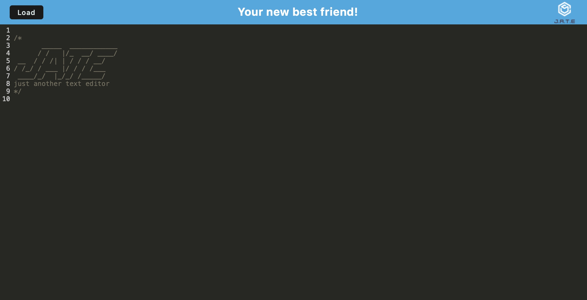

# Offline Text Editor

### Table of Contents
1. [Description](#description)
2. [Installation](#installation)
3. [Technologies](#technologies) 
4. [Usage](#usage)
5. [Images](#images)
6. [Contributing](#contributing)
7. [Collaborators](#collaborators)
8. [Tests](#tests)
9. [Questions](#questions)
10. [License](#license)
11. [Project URL](#project-url)
12. [Video Walkthrough](#video-walkthrough)

### Description
Offline Text Editor is a project that allows you to edit and save text even when you're offline. It includes features for storing and retrieving text from an IndexedDB database, making it useful for scenarios where internet connectivity may be unreliable.

### Technologies
This project utilizes the following technologies:

- JavaScript
- Express.js
- Workbox for Service Workers
- CodeMirror for text editing
- IndexedDB for local storage

### Installation
To install this project, follow these steps:

1. Clone the repository to your local machine.
2. Navigate to the client directory and run npm install to install client-side dependencies.
3. Navigate to the server directory and run npm install to install server-side dependencies.

### Usage
To use this project, follow these steps:

1. Start the server by running npm run server in the server directory.
2. Start the client by running npm start in the client directory.
3. Access the application in your web browser.

### Images

### Contributing
Contributions to this project are currently not being accepted. If you would like to contribute, please contact me at the email listed below.

### Collaborators
This project was completed with guidance and assistance from EdX/UC Berkeley Extension tutor, Jose Lopez. If any code may have been referenced to complete this assignment is was sourced from EdX curriculum content.

### Tests
No specific test instructions provided.

### Questions
If you have any questions, please contact me:

- GitHub: [MMerzoug](https://github.com/MMerzoug)
- Email: Monique.Merzoug1@gmail.com

### License
This project is licensed under the [MIT License](https://opensource.org/licenses/MIT).

### Project URL
https://offline-text-editor-9980c53bf40a.herokuapp.com

